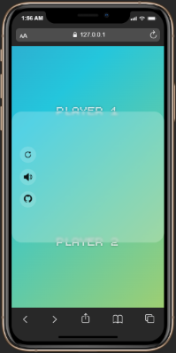
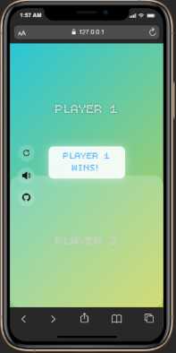

#  Tug of Tap 🎮

**Tug of Tap** is a fun and engaging **two-player mobile game** where players compete to win by quick reflexes and strategy. It's designed to give an immersive and exciting experience for mobile users.

---

## 🕹️ Game Overview

- **Type:** Two-player mobile game  
- **Platform:** Mobile browsers / PWA compatible  
- **Objective:** Compete with your friend and see who wins by tapping fast and smart!  
- **Features:**
  - Responsive for **all mobile devices**
  - Engaging **animations** and **sound effects**
  - Winner celebration with **flash animation and confetti**
  - Reset and music control buttons for a smooth gaming experience

---

## 📸 Screenshots

| Screenshot 1 | Screenshot 2 |
|--------------|--------------|
|  |  |

---

## ⚙️ How to Play

1. Open the game on your mobile device.  
2. Each player taps on their side to compete.  
3. Use the **Reset button** to restart the game anytime.  
4. Use **Mute / Unmute** to control background music.  
5. First player to reach the goal wins! Enjoy the flash and confetti celebration when someone wins.  

---

## 🎨 Features & Controls

- **Reset Button:** Restart the game anytime.  
- **Mute / Unmute:** Control background music.  
- **GitHub Link:** [Source Code](https://github.com/prince-gh)  
- **Winner Animation:** Full-screen flash and confetti for an immersive win experience.  
---

## 💖 Developed with Love by Prince

Special thanks to all who inspired and helped along the way.  

*(This project was also assisted by ChatGPT for guidance and code suggestions. ♥)*
